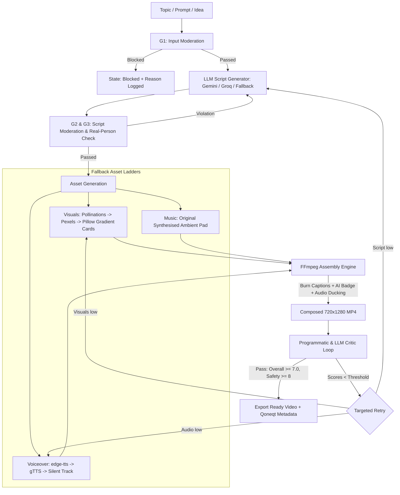

# QoneqtReel Engine 🎬⚡

**An autonomous, self-looping vertical video pipeline for the Qoneqt Global Feed.**  
*Built for the Qoneqt x CTRL FREAK Hackathon.*

---

## 1. Overview
**QoneqtReel Engine** turns any topic, idea, trend, or question into a publish-ready 30-second vertical video (9:16, 720x1280, 30fps) with zero human intervention.

It is designed as an industrial-grade closed-loop generator: given a queue of topics, it generates scripts, creates high-resolution visuals, synthesizes voiceovers, generates original ambient background pads, burns in mobile safe-zone captions, applies an AI-disclosure watermark, and runs an automated quality critic with targeted retries before exporting.

---

## 2. Architecture & Pipeline Flow



---

## 3. The 5 Safety Guardrails

| Guardrail | Stage | Enforcement Mechanism | Failure Action |
|---|---|---|---|
| **G1: Input Moderation** | Pre-scripting | Deterministic rule-based filter + LLM safety classification for hate, violence, sexual content, weapons, self-harm, and scams. | Immediate hard block with logged reason; 0 API calls wasted. |
| **G2: Script Moderation** | Post-scripting | Inspects generated script for safety violations, offensive themes, and risky claims in news/health/finance. | Targeted retry with safety feedback; blocks if persistent. |
| **G3: No Real People / Deepfakes** | Script & Visuals | Rejects celebrity, politician, and private individual likenesses, names, or cloned voices. | Automatic entity scrubbing or script regeneration. |
| **G4: Copyright-Clean Assets** | Assets | Original synthesised ambient music pad via NumPy (zero copyright claims), AI-generated images, or CC0 stock. | No external copyrighted audio or trademarked imagery permitted. |
| **G5: AI Disclosure & Disclaimers** | Compose & Post | Permanent `"AI-GENERATED CONTENT"` watermark badge burned into video, and caption always ends with `"AI-generated video."` | Hardcoded into video composition engine and output metadata. |

---

## 4. Output Specification

| Property | Value |
|---|---|
| **Aspect Ratio** | 9:16 Vertical (Reel / Shorts format) |
| **Resolution** | 720x1280 pixels |
| **Target Duration** | ~30 seconds (25s - 32s) |
| **Video Format** | MP4 (`libx264`, `yuv420p`, 30 fps) |
| **Audio Format** | AAC 128 kbps (`edge-tts` Indian-English neural voice + ducked ambient pad) |
| **Captions** | Burned-in, high-contrast typography in mobile safe zone (middle-lower third) |
| **Disclosure** | Visible bottom-right AI badge + metadata caption disclaimer |

---

## 5. Quickstart & Local Setup

### Prerequisites
- Python 3.11+
- FFmpeg (automatically detected from system PATH or bundled via `imageio-ffmpeg`)

### 1. Installation
```bash
git clone <repo-url>
cd <repo-folder>
pip install -r requirements.txt
```

### 2. Environment Configuration
Copy the template and add your API keys:
```bash
cp .env.example .env
```
Edit `.env`:
```env
LLM_PROVIDER=gemini            # gemini | groq
GEMINI_API_KEY=your_key_here
GROQ_API_KEY=your_backup_key   # optional
PEXELS_API_KEY=your_photo_key  # optional
MAX_ATTEMPTS=3
```
*(Note: If no keys are provided, the engine runs fully offline using its built-in fallback ladder!)*

### 3. Launch the Studio UI
```bash
uvicorn api:app --reload --port 7860
```
Open **`http://localhost:7860`** in your browser.

---

## 6. Batch Runner CLI

Run multiple topics autonomously in batch mode:
```bash
python scripts/run_batch.py samples/topics.txt
```

The runner outputs:
- **`batch_report.json`**: Detailed JSON metrics for all jobs.
- **`batch_report.md`**: Markdown summary table showing pass rates, runtimes, and guardrail verdicts.

---

## 7. API Reference

| Method | Endpoint | Description |
|---|---|---|
| `GET` | `/api/health` | Health and provider status |
| `POST` | `/api/jobs` | Create video job `{topic, style?, trend?}` |
| `POST` | `/api/batch` | Submit a batch list of topics `{topics: [...]}` |
| `GET` | `/api/jobs/{id}` | Poll job status, stage logs, and quality scores |
| `GET` | `/api/jobs/{id}/video` | Download final MP4 video |
| `GET` | `/api/jobs` | List recent job executions |
| `POST` | `/api/trend/expand` | Expand a trend keyword into 3 video angles |

---

## 8. Deploying to Hugging Face Spaces / Render

### Hugging Face Spaces (Docker Space)
1. Create a new Space on [Hugging Face Spaces](https://huggingface.co/spaces).
2. Select **Docker** as the SDK.
3. Push this repository to your Space repository.
4. Set secret `GEMINI_API_KEY` (and optionally `GROQ_API_KEY`) under Space **Settings -> Variables and Secrets**.
5. Your public URL will be live at `https://huggingface.co/spaces/<username>/<space-name>`.

---

## 9. Running Verification Tests

Run the test suite:
```bash
python -m pytest tests/test_engine.py -v
```

This verifies:
1. Pydantic schema validation & strict JSON structure
2. Guardrail G1 blocking all adversarial prompts
3. Safe prompt acceptance
4. FFmpeg programmatic composition checks
